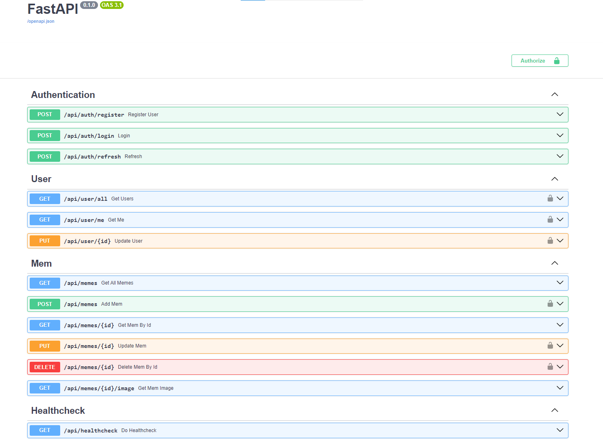
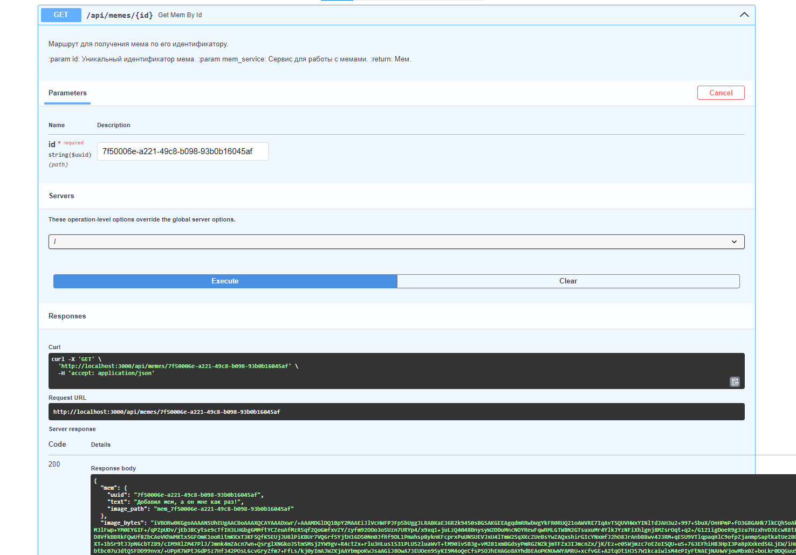
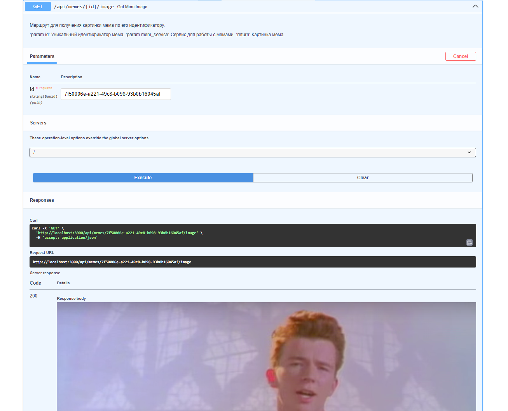

# test_task_memes
Тестовое задание на ***Python-разработчика***

> Приложение предоставляет **REST-API** для управления мемами с картинками. Также реализована аутентификация и права доступа с 2 ролями: пользователь и администратор.  
> Приложение реализовывалось с соблюдением принципов **DDD**.

- Хранение данных - **PostgreSQL**
- Хранение изображений - **MinIO**

## Описание переменных окружения:
- **APP_PORT** - порт, на котором запущен сервер
- **POSTGRES_URL** - URL подключения к PostgreSQL в формате `postgresql+asyncpg://<Имя_пользователя>:<Пароль>@<Адрес>:<Порт>/<Имя_БД>`
- **S3_STORAGE_URL** - URL подключения к S3 хранилищу
- **IMAGES_BUCKET_NAME** - название бакета S3 с изображениями
- **ACCESS_SECRET_KEY** - секретный ключ для генерации токена доступа
- **REFRESH_SECRET_KEY** - секретный ключ для генерации токена обновления
- **ACCESS_EXPIRATION** - время жизни токена доступа в минутах
- **REFRESH_EXPIRATION** - время жизни токена обновления в минутах
- **JWT_ALGORITHM** - алгоритм кодирования токенов
- **PASSWORD_SALT** - соль для хэширования пароля пользователя
- **ITERS_HASHING** - количество итераций для хэширования пароля пользователя
- **HASH_ALGORITHM** - алгоритм хэширования пароля пользователя

> Для запуска приложения с помощью Docker Compose необходимо определить дополнительные переменные для PostgreSQL и S3-совместимого хранилища:
- **POSTGRES_USER** - имя пользователя PostgreSQL
- **POSTGRES_PASSWORD** - пароль пользователя PostgreSQL
- **POSTGRES_DB** - имя базы данных PostgreSQL
- **POSTGRES_PORT** - порт PostgreSQL
- **S3_ACCESS_KEY_ID** - идентификатор ключа S3
- **S3_SECRET_ACCESS_KEY** - секретный ключ S3
- **S3_PORT** - порт S3
- **S3_CONSOLE_PORT** - локальный порт с консоли S3

> Для создания базового (первого) пользователя-администратора необходимо определить дополнительные переменные с данными его аккаунта:
- **ADMIN_FIRST_NAME** - имя администратора
- **ADMIN_SECOND_NAME** - фамилия администратора
- **ADMIN_LOGIN** - логин администратора
- **ADMIN_PASSWORD** - пароль администратора
- **ADMIN_EMAIL** - почтовый адрес администратора

## Ручной запуск на хостовой машине

1. Установить `Python 3.12`
2. Установить `PostgreSQL 16.0+`
3. Установить объектное хранилище, совместимое с `API S3` (например, `MinIO`)
4. Установить зависимости из `requirements.txt`
5. Создать файл `.env` с перечисленными переменными окружения
6. Обновить базу данных миграциями с помощью команды `alembic upgrade head`
7. Запустить проект командой `python main.py`

## Запуск через Docker Compose

1. Создать файл `.env` с перечисленными переменными окружения
2. Запустить сборку командой `docker compose -f docker-compose.yml up`

## Запуск тестов

Запуск тестов осуществляется командой `pytest -v`

## Пример мема

  
Пример мема

    
  

  

